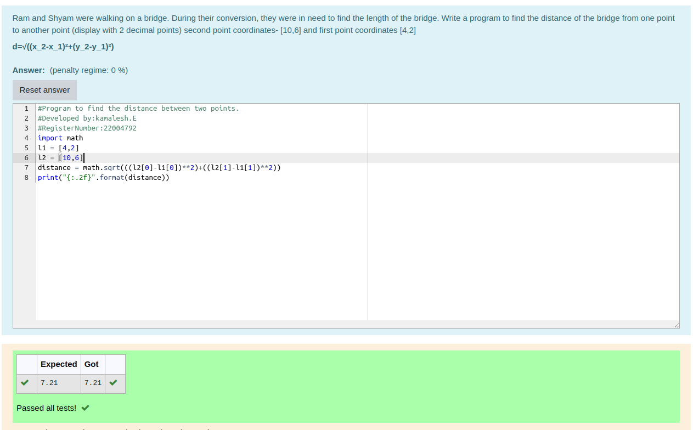

# DISTANCE-BETWEEN-TWO-POINTS

## AIM:
To write a python program to find the distance two 2 points
## ALGORITHM:
### Step 1: Import math into the program
### Step 2: Input the co-ordinates to calculate the distance between them
### Step 3: Substitute the values in the distance formula  
### Step 4: Print the programm
### Step 5: End the programm
### PROGRAM:
```python
image.png
```


### OUTPUT:


### RESULT: Thus the program is executed
